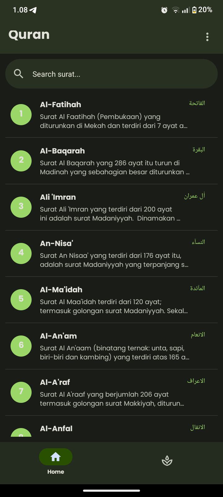

# 📖 Quran App


A simple **Qur'an mobile application** built with **React Native Expo** that allows users to read the Qur'an easily on Android devices.

---

## 📸 Preview



> Replace this image with screenshots of your application.

---

## ✨ Features

- 📖 **Complete 114 Surahs** of the Qur'an
- 🕌 **Arabic text** with **Latin transliteration**
- 🇮🇩 **Indonesian translation**
- 💾 **Save last reading progress** so users can continue where they left off
- 🌙 **Asmaul Husna** (99 Names of Allah)
- 📱 Simple and clean mobile interface

---

## 📱 Platform

Currently available for:

- ✅ **Android**

Built using **React Native with Expo**.

---

## 🚀 Getting Started

Clone the repository:

```bash
git clone https://github.com/username/quran-app.git
```

Go to the project directory:

```bash
cd quran-app
```

Install dependencies:

```bash
npm install
```

Run the project:

```bash
npx expo start
```

Then run it on an Android device or emulator.

---

## 🎯 Purpose

This project was created to provide a simple and accessible way for Muslims to read the Qur'an on mobile devices.

---

## 👨‍💻 Author

Created by **Ikhsan**

If you find this project useful, consider giving it a ⭐ on GitHub.
